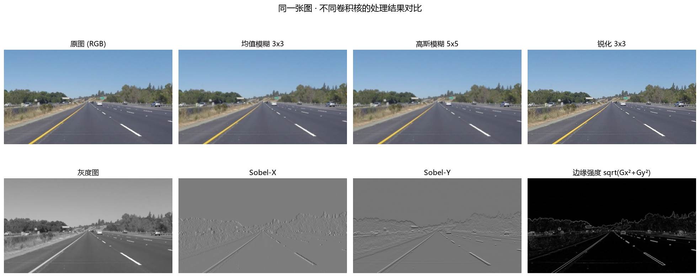
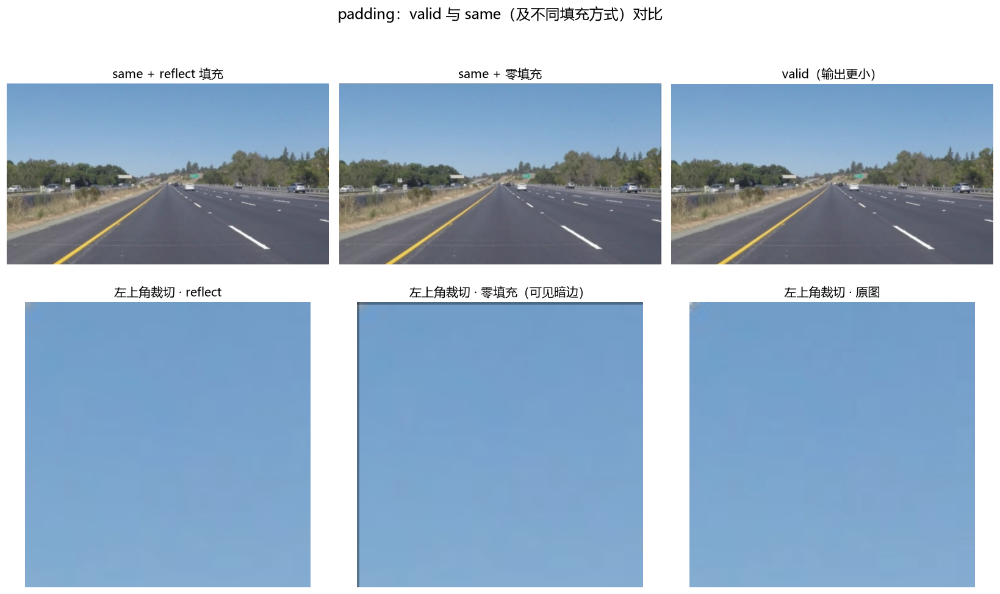

# Jotang-ml-task2

本仓库包含机器学习实践的两个部分：

- **实践 1：数字图像表示与二维卷积** —— 本文件的以下内容：手写 NumPy 卷积、
  均值/高斯/锐化/Sobel 卷积核、valid 与 same 填充对比（另见 `conv_lab.py` 与 `notebook.ipynb`）。
- **实践 2：训练猫狗分类器（Dogs vs. Cats）** —— 见
  [`cats-vs-dogs/README.md`](cats-vs-dogs/README.md)：数据准备、预处理、CNN 训练、
  特征图与错误分析、数据增强对照、独立推理程序与模型结构图。

---

数字图像的表示与二维卷积实验（Task 2）。素材是一张 960×540 的公路行车视角照片
`images/outer1.png`，围绕它完成了「图像表示 → 读取成 NumPy/PyTorch → 手写二维卷积 →
四种卷积核处理 → 观察解释 → valid/same 填充对比」的完整流程。

核心卷积由 **NumPy 手写**，没有使用 `cv2.filter2D`、`scipy.signal.convolve2d`、
`torch.nn.Conv2d` 等现成实现。

## 产物

| 文件 | 说明 |
| --- | --- |
| `conv_lab.py` | 唯一源码（percent 格式）：讲清 1–7 题，跑完生成全部结果 |
| `notebook.ipynb` | 由 `conv_lab.py` 自动生成并**已执行**的 Notebook（含结果与图）|
| `build_notebook.py` | 把 `conv_lab.py` 转成并执行 `notebook.ipynb` |
| `images/outer1.png` | 输入图片 |
| `outputs/` | 所有输出图片、`results.json`、`report.txt` |

## 复现

```bash
pip install -r requirements.txt
python conv_lab.py          # 生成 outputs/ 下的全部结果
python build_notebook.py    # 重新生成并执行 notebook.ipynb
```

---

## 1. 像素、RGB、灰度图与彩色图

数字图像本质上是一个**数字矩阵**。**像素（pixel）** 是矩阵中的一个采样点，是图像的最小单位，
像素上存放的数值表示该点颜色的强度。

- **灰度图**：每个像素只有 **1 个数值**（亮度，0=黑、255=白），数组形状 `(H, W)`。
- **彩色图**：每个像素有 **3 个数值**（R、G、B 三个通道，各 0–255），数组形状 `(H, W, 3)`。
  RGB 是加色模型，三个通道组合可表示约 1677 万种颜色。
- 常见存储类型是 `uint8`（0–255）；做卷积等运算时会先转成浮点（`float32/float64`）避免溢出。

两者的区别：灰度只保留**明暗**（1 个通道），彩色额外携带**颜色**（3 个通道）。彩色转灰度就是按
亮度权重 `Y = 0.299R + 0.587G + 0.114B` 把 3 个通道加权求和，降维成 1 个通道。

## 2. 读成 NumPy 数组和 PyTorch Tensor

Pillow 打开后 `np.array(...)` 得到 **HWC** 排列的数组，打印结果：

```
Pillow 模式 : RGB  尺寸(size=W,H): (960, 540)
NumPy 数组  shape = (540, 960, 3)   (H, W, C)
            dtype = uint8
            min   = 16   max = 255
中心像素 [y=270, x=480] 的 RGB = [111, 122, 118]
左上角像素 [y=0, x=0] 的 RGB = [181, 197, 213]

PyTorch HWC tensor shape = (540, 960, 3)  dtype = torch.uint8
PyTorch CHW tensor shape = (3, 540, 960)  dtype = torch.uint8   -> (C, H, W)
归一化后 dtype = torch.float32  min = 0.0627  max = 1.0
```

**每个维度/数值的含义**（`shape = (540, 960, 3)`）：

- `540` → 高度 H，图像的行数（自上而下）。
- `960` → 宽度 W，图像的列数（自左向右）。
- `3` → 通道 C，依次是 R / G / B。
- 数值 0–255 是 `uint8`，表示该通道在该点的亮度。中心像素 `[111, 122, 118]` 即该点
  R=111、G=122、B=118（偏灰绿，正是路面色调）。

**HWC 与 CHW 的区别**：两者只是内存里轴的顺序不同，数据完全一样。
NumPy/Pillow 天然是 **HWC**（行-列-通道，便于读写和显示）；PyTorch 卷积习惯 **CHW / NCHW**
（每个通道是一张完整二维平面，卷积核按通道整体滑动更自然）。互转：
`np.transpose(arr, (2, 0, 1))` 或 `torch.permute(t, (2, 0, 1))`。

## 3. 二维卷积的基本过程

- **卷积核（kernel / filter）** 是一个小权重矩阵（如 3×3、5×5），它定义“要看邻域的什么模式”：
  全取平均→模糊；中间正、四周负→锐化；左右/上下做差分→边缘检测。
- **怎么移动**：把卷积核当作滑动窗口，从左上角开始，按 **stride（步长）** 先向右逐列滑，
  一行走完再下移一行，直到覆盖整幅图；边缘用 **padding（填充）** 补像素。
- **每个位置做什么**：取出与核同样大小的邻域 patch，把 patch 与核 **逐元素相乘再求和**，
  得到输出图对应位置的 1 个数值：`out[y, x] = Σ Σ patch[i, j] * kernel[i, j]`。
  彩色图则每个通道分别做同样的运算。
- 所有位置的结果拼起来就是新的**特征图（feature map）**。

## 4. 手写二维卷积（仅 Python + NumPy）

`conv_lab.py` 提供两个实现，且互相验证一致（最大差异 = 0.0）：

1. `conv2d`：先 `np.pad` 补边，再对核的每个权重把整幅图**平移相乘后累加**——把卷积定义向量化，
   支持灰度图 `(H,W)` 与彩色图 `(H,W,C)`、`valid/same/整数` 填充、`stride`、多种填充模式。
2. `conv2d_naive`：完全按定义写的三重（四重）循环，用于验证正确性。

```python
out = np.zeros((out_h, out_w, img.shape[2]), dtype=np.float64)
for i in range(kh):
    i_end = i + stride * out_h
    for j in range(kw):
        j_end = j + stride * out_w
        window = padded[i:i_end:stride, j:j_end:stride, :]   # 取出对齐的邻域
        out += kernel[i, j] * window                          # 逐元素相乘后累加
```

只用到了 `np.pad` 与基础切片/广播，卷积的乘加运算完全手写。

## 5. 四种卷积核的处理结果

使用的卷积核：

- **均值模糊 3×3**：全 1/9。
- **高斯模糊 5×5**：按 `g(x,y)=exp(-(x²+y²)/(2σ²))` 生成并归一化，σ=1.0：

  ```
  0.00297 0.01331 0.02194 0.01331 0.00297
  0.01331 0.05963 0.09832 0.05963 0.01331
  0.02194 0.09832 0.16210 0.09832 0.02194
  0.01331 0.05963 0.09832 0.05963 0.01331
  0.00297 0.01331 0.02194 0.01331 0.00297
  ```

  另有经典整数近似（÷256）：`[[1,4,6,4,1],[4,16,24,16,4],[6,24,36,24,6],[4,16,24,16,4],[1,4,6,4,1]]`。
- **锐化 3×3**：`[[0,-1,0],[-1,5,-1],[0,-1,0]]`。
- **边缘检测**：Sobel-X、Sobel-Y，并合成边缘强度 `sqrt(Gx²+Gy²)`。



可以看到：均值/高斯让画面变平滑；锐化让车道线等边缘更“跳”出来；Sobel-X 主要点亮**竖直/竖向**
边缘（车道线、树干），Sobel-Y 主要点亮**水平**边缘（地平线、指示牌、车顶），合成的边缘强度图里
路面标线、护栏、树与天的分界都清晰可见。

## 6. 为什么会有这些变化

- **均值模糊**：新像素 = 3×3 邻域 9 个像素的平均。相邻像素差异被“抹平”，代表细节/噪声/窄边缘的
  **高频成分被衰减**，只留整体明暗（低频），所以变糊、变平滑；代价是真实边缘也被模糊，且带方块感。
- **高斯模糊**：同样是加权平均，但权重来自高斯分布——中心权重最大、越远越小。它更柔和自然，
  本质仍是低通滤波，抑制高频 → 变模糊，但过渡更平滑、无明显方块感。
- **锐化**：核 `[[0,-1,0],[-1,5,-1],[0,-1,0]]` 可改写成 `原图 + (原图 − 邻域均值)`，
  即 **原图 + 高频（边缘）成分**。它放大局部差异 → 边缘对比增强、细节更突出，看起来更清晰
  （同时会放大噪点）。核系数之和 = 1，保证整体亮度不变。
- **Sobel**：Gx 核把左右两列像素相减（`-1,0,+1`，中间行权重更大），Gy 核把上下两行相减，
  近似计算灰度在水平/垂直方向的**导数（变化率）**：平坦区域结果≈0，边缘处灰度突变 → 梯度大 →
  被检测出来。合成 `sqrt(Gx²+Gy²)` 得到与边缘方向无关的边缘强度图。

用拉普拉斯响应的方差量化“锐利度/高频能量”，与上面的解释一致：

```
原图          =  60.25
均值模糊 3x3  =  14.13     # 高频被压低 → 变模糊
高斯模糊 5x5  =  11.22     # 更平滑
锐化 3x3      = 801.06     # 高频被放大 → 更锐利
```

## 7. valid 与 same 的对比

输出尺寸公式（输入 H、核 K、填充 P、步长 S）：`out = floor((H + 2P − K) / S) + 1`。

- **valid**：P=0，只在能完整放下核的位置计算，输出比输入小（`H−K+1`），边缘像素不会被当作中心。
- **same**：P=(K−1)/2（奇数核），输出与输入同尺寸，边缘也能算，但靠的是**补出来的像素**，
  因此边缘结果受填充方式影响。



实测（输入 540×960，3×3 均值核）：

```
same  (P=1, S=1) 输出 = (540, 960)  -> 与输入相同
valid (P=0, S=1) 输出 = (538, 958)  -> 每边少 (K-1)=2 像素

same 下边缘一圈 reflect vs 零填充 平均绝对差 = 21.28   （边框可见暗边）
中心区域 reflect vs 零填充 平均绝对差       = 0.00    （中心不受填充方式影响）
```

上图第三列是 same + 零填充，边框出现明显暗边；reflect 填充则没有。尺寸关系表：

| K | S | P (valid / same) | out (valid) | out (same) |
| --- | --- | --- | --- | --- |
| 3 | 1 | 0 / 1 | 538 | 540 |
| 3 | 2 | 0 / 1 | 269 | 270 |
| 5 | 1 | 0 / 2 | 536 | 540 |
| 5 | 2 | 0 / 2 | 268 | 270 |
| 7 | 1 | 0 / 3 | 534 | 540 |
| 7 | 2 | 0 / 3 | 267 | 270 |

结论：

- **核越大**：same 下输出不变（靠加大填充维持），valid 下输出明显变小、边缘被裁更多。
- **填充 P 越大**：输出越大；P=(K−1)/2 时 same 输出与输入等高。
- **步长 S 越大**：输出约按 1/S 缩小；S>1 时 same 也不一定与输入同尺寸。
- 统一公式：`out = floor((H + 2P − K) / S) + 1`（宽同理）。
