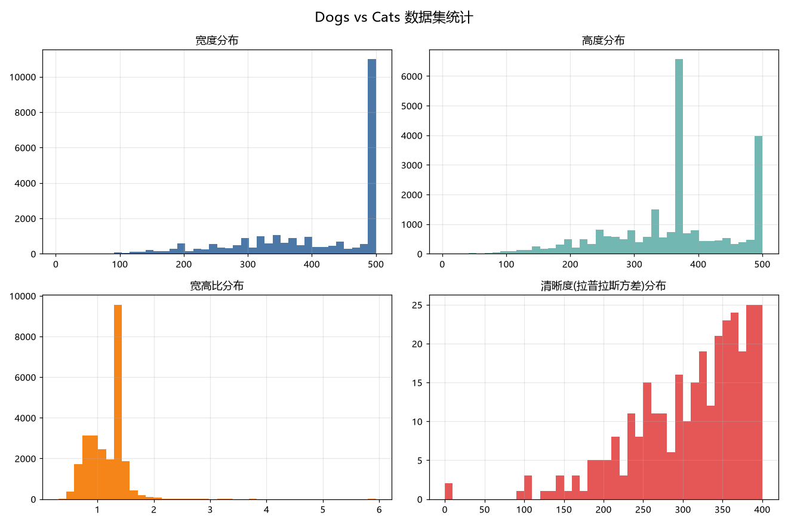
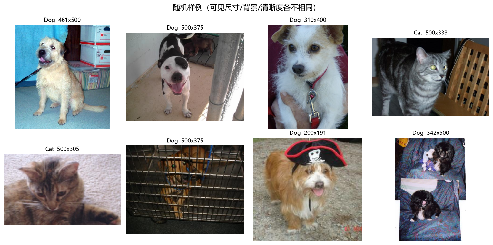
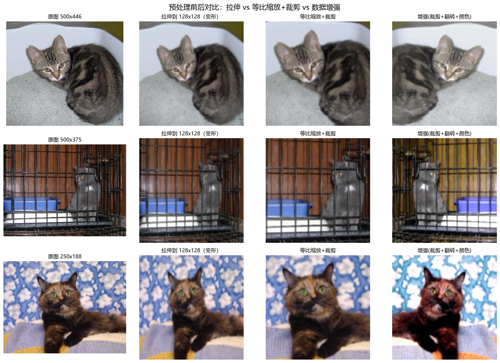
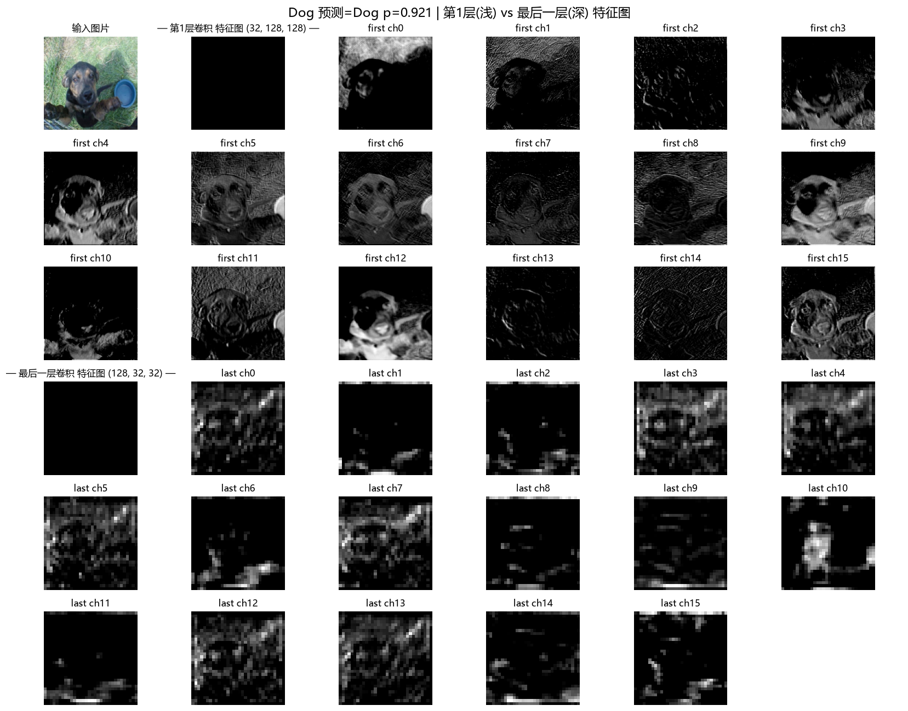
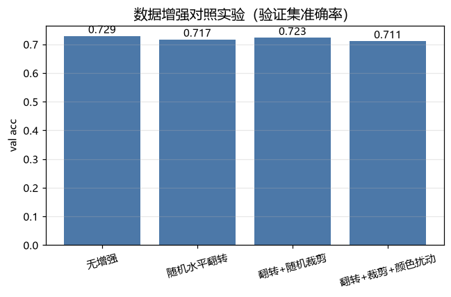
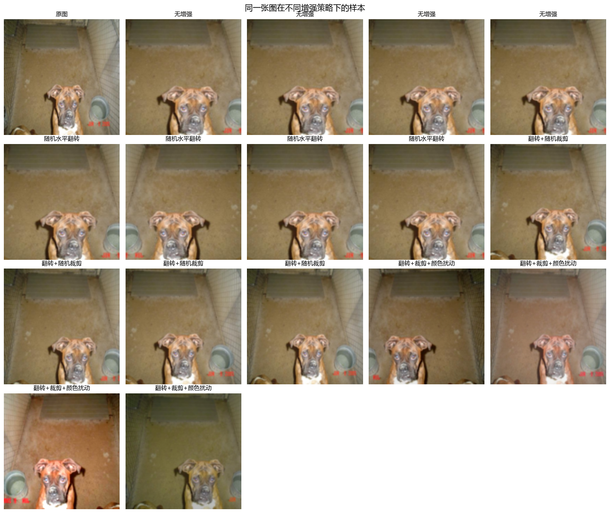
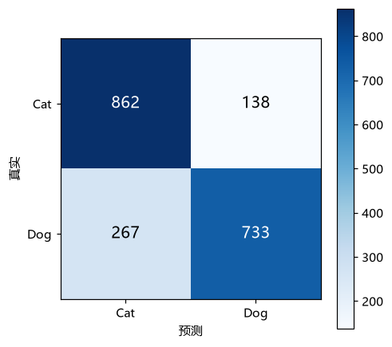
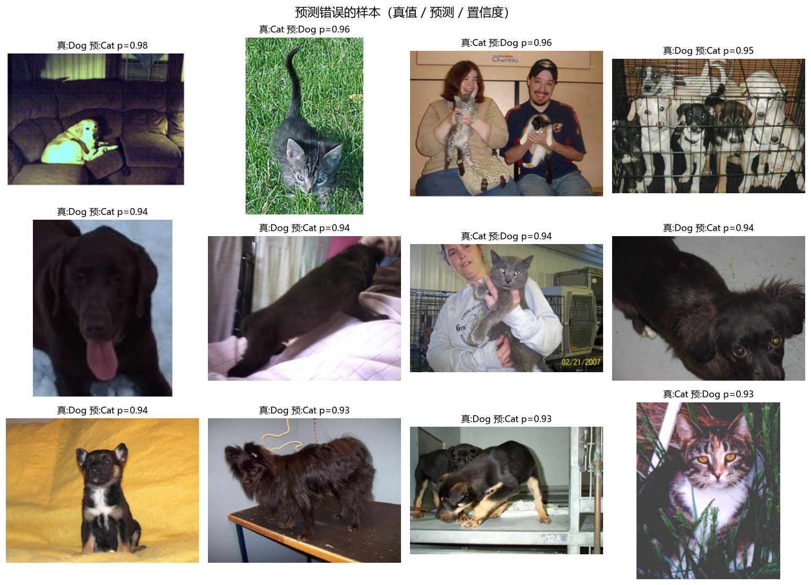
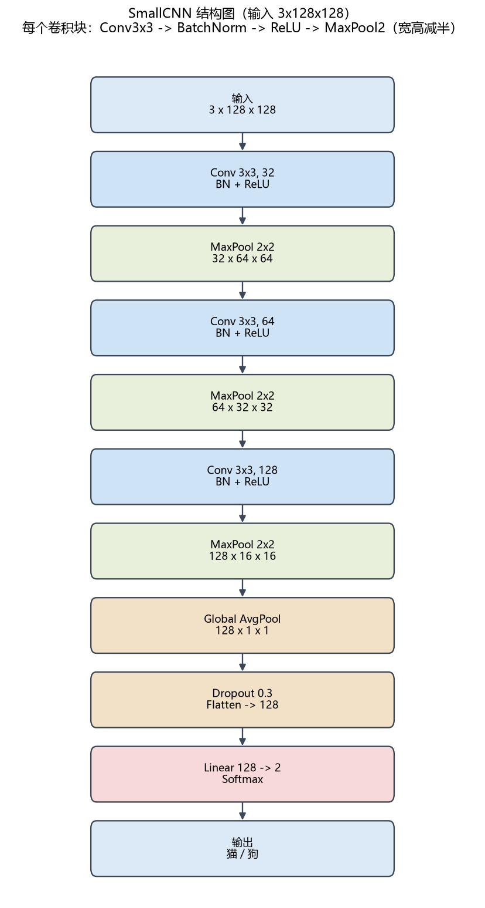

# 实践 2：训练猫狗分类器（Dogs vs. Cats）

从零实现的猫狗二分类完整项目：数据准备 → 预处理 → CNN 训练 → 特征图/错误分析 →
数据增强对照 → 保存模型与独立推理程序 → 模型结构图。全部代码用 PyTorch（CPU）写成，
数据、代码、结果与说明都在本目录。

## 结果速览

| 项目 | 数值 |
| --- | --- |
| 数据集 | Kaggle Dogs vs. Cats，24998 张有效图（Cat 12499 / Dog 12499） |
| 划分 | train 8000 / val 1000 / test 2000（每类各半） |
| 主模型 SmallCNN | 93,730 参数，val acc **0.806**（14 epochs） |
| 测试集准确率 | **0.7975**（Cat 召回 0.862 / Dog 召回 0.733） |
| 全连接基线 MLP | 6,555,650 参数（约 70 倍），val acc 仅 **0.660** |
| 推理程序 | `python inference.py --image your.jpg` |

## 环境与复现

```bash
pip install -r requirements.txt

python data_prep.py --all            # 下载/解压/统计/划分（数据放在 ../data/catsdogs）
python explore.py --all              # 任务 1、2 的统计与可视化
python train.py --model cnn --epochs 14 --tag cnn_aug     # 任务 3
python train.py --model mlp --epochs 5 --size 64 --tag mlp_base   # 全连接基线
python aug_experiment.py --epochs 3  # 任务 6 数据增强对照
python analysis.py --all --ckpt outputs/cnn_aug_best.pt   # 任务 4、5、7
python architecture.py               # 任务 9
python inference.py --image path/to/photo.jpg            # 任务 8
```

## 文件结构

| 文件 | 作用 |
| --- | --- |
| `data_prep.py` | 下载/解压/统计/划分，生成 `manifest.csv` 与 `splits/*.csv` |
| `dataset.py` | 预处理变换（拉伸/裁剪/增强）、`Dataset`、`DataLoader` |
| `models.py` | `SmallCNN` 与 `MLP` |
| `train.py` | 训练循环、曲线、层形状记录、保存最佳模型 |
| `explore.py` | 任务 1、2 的图 |
| `analysis.py` | 特征图可视化、错误分析、阈值校准改进 |
| `aug_experiment.py` | 数据增强对照实验 |
| `inference.py` | **独立**推理程序（输入图片 → 猫/狗 + 概率 + 处理后图片） |
| `architecture.py` | 模型结构图 |
| `outputs/` | 所有图、`*_history.json`、最佳模型 `cnn_aug_best.pt` |

---

## 1. 数据集观察

用的是 Kaggle *Dogs vs. Cats*（公开镜像 `kagglecatsanddogs_5340.zip`）。扫描全部文件：

- 文件数：Cat 12500、Dog 12500；其中 **2 张损坏**（无法解码）被跳过 →
  **有效 24998 张：Cat 12499、Dog 12499**，类别完全均衡。
- 尺寸**很不统一**：宽 min 4 / 中位 448 / max 500，高 min 4 / 中位 375 / max 500。
- 宽高比 min 0.31 / 中位 1.27 / max 5.94，**只有 16.7% 接近正方形** → 不能直接拉伸到正方形。
- 清晰度（64×64 缩略图上的拉普拉斯方差）p10 ≈ 758、中位 ≈ 1611、p90 ≈ 3117，差异明显；
  拍摄背景也五花八门（草地、沙发、笼子、人抱着猫狗等）。




## 2. 数据读取与预处理

预处理流程（`dataset.py`）：

1. 打开图片转 RGB；
2. 缩放/裁剪到 128×128；
3. `ToTensor()` 变成 `(3,128,128)` 的 float；
4. 用 ImageNet 的均值/方差归一化。

关于“怎么组成 batch”：`CatsDogsDataset` 返回 `(图片 tensor, 标签)`，
`DataLoader` 每次取 `batch_size=64` 个样本堆叠成一个 batch，
张量形状为 **`(64, 3, 128, 128)`**，训练时还会打乱顺序并用多进程并行读图。

三种缩放策略对比：直接 `Resize((128,128))` 会**改变宽高比**（第 2 列可见明显的横向/纵向拉伸），
而“等比缩放到 146 再中心裁剪到 128”（第 3 列）保持比例、不拉伸；第 4 列是训练用的随机增强。



## 3. CNN 结构

`SmallCNN`：3 个卷积块，每块 `Conv3x3 → BatchNorm → ReLU → MaxPool2`，
通道 3→32→64→128；随后 `Global Average Pooling → Flatten(128) → Dropout(0.3) → Linear(2)`。
共 **93,730** 个可训练参数，比全连接基线小得多。

## 4. 一张图经过各层的 Tensor 形状（输入 128×128）

| 层 | 类型 | 输出形状 (N,C,H,W) |
| --- | --- | --- |
| block1 | Conv3x3 → BN → ReLU | (1, 32, 128, 128) |
| block1 | MaxPool2 | (1, 32, 64, 64) |
| block2 | Conv3x3 → BN → ReLU | (1, 64, 64, 64) |
| block2 | MaxPool2 | (1, 64, 32, 32) |
| block3 | Conv3x3 → BN → ReLU | (1, 128, 32, 32) |
| block3 | MaxPool2 | (1, 128, 16, 16) |
| head | GlobalAvgPool → Flatten | (1, 128) |
| head | Linear | (1, 2) |

变化规律：**宽、高每过一个卷积块减半（128→64→32→16），通道数翻倍（32→64→128）**。
卷积本身不改变尺寸（`padding=1` 的 3×3 卷积保持 H、W），是 **MaxPool2** 在把宽高减半；
通道数由每一层**卷积核的个数**决定。

## 5. 特征图可视化

同一张图，第 1 层卷积（浅）与最后一层卷积（深）的部分通道：



- **第 1 层（32 通道，128×128）**：不同通道像一组“边缘/方向/颜色”检测器——
  有的通道几乎只对强边缘（如轮廓、狗鼻子高光）响应，有的对暗纹理/草地纹理敏感，
  呈现典型的 Gabor 状明暗条纹。**它们关注的是低级的边缘、方向、局部颜色对比。**
- **最后一层（128 通道，16×16）**：分辨率低、响应稀疏，每个通道只在图片的少数区域亮，
  对应更高层的语义（比如“某个部位/某种纹理出现在哪里”）。
  通道之间差异变大——这正是“逐层从纹理走向语义”的体现。

不同通道对同一张图产生的结果不同，正是因为每个卷积核学到的模式不同。

## 6. 数据增强对照实验

对同样的网络、同样划分、同样随机种子，只改变训练集增强策略，各训练 3 个 epoch：

| 增强策略 | val acc |
| --- | --- |
| 无增强 | 0.729 |
| 随机水平翻转 | 0.717 |
| 翻转 + 随机裁剪 | 0.723 |
| 翻转 + 裁剪 + 颜色扰动 | 0.711 |




**如何解读**：只训练 3 个 epoch 时，各配置差异仅约 ±1.5%，基本落在**run 级噪声**内，
而且“无增强”反而略高——因为增强让训练任务更难，短训练下模型还没充分收敛；
增强的价值在于**抑制过拟合**，只有在训练更久/模型更大时才体现。佐证：主模型用
翻转+裁剪训练 14 个 epoch 达到了 **0.806**，明显高于这些 3-epoch 结果。

**哪些变换合理、哪些可能出问题**：
- 水平翻转：猫狗左右对称，标签不变 → **合理且几乎无风险**。
- 随机裁剪：模拟不同构图与尺度，提升鲁棒性 → 合理；但裁得太狠可能把主体裁掉（只剩背景），
  相当于**破坏标签**。
- 颜色扰动：提升对光照/色偏的鲁棒 → 适度合理；过强会失真（把花色改得面目全非），
  可能让判断依据失真。
- 不该用、会破坏标签的例子：垂直翻转（狗被倒过来）、大角度旋转、极端裁剪。

## 7. 错误分析与改进

在测试集（2000 张）上：准确率 **0.7975**，混淆矩阵
`[[862, 138], [267, 733]]`，Dog 的召回率只有 **0.733**，Cat 有 **0.862** ——
模型**明显偏向预测“猫”**（把不少狗判成了猫）。




看错误样本，原因主要有：

- **画面里有多个主体 / 有人抱着猫狗**：模型容易看错主体；
- **背景干扰**（草地、笼子、暗环境、强色偏），主体不突出；
- **姿态/视角奇怪**（只露一部分、趴着、侧躺）或**分辨率低、偏暗**；
- 猫狗在**深色毛发 + 特定背景**下纹理接近，容易混。

**改进尝试**：
1. **水平翻转 TTA**（原图 + 翻转取平均概率）：准确率 0.7975 → 0.7980（+0.0005，几乎无变化）。
2. **判别阈值校准**：在验证集上搜索最佳阈值 `t*`（预测为狗的阈值），t*=0.47 可使验证集
   **平衡准确率**升到 0.8110。用到测试集：整体准确率 0.7975 → 0.7960（几乎不变），
   但召回更平衡了：**Cat 0.835 / Dog 0.757**（原来 0.862 / 0.733）。

结论：TTA 对这个小模型帮助有限；**阈值校准几乎不损精度，却能显著缓解“偏向猫”的偏差**。
更根本的改进方向是更多数据/更长训练、更强的正则，或换成迁移学习（用预训练骨干）。

## 8. 保存模型与独立推理程序

训练脚本按验证集准确率保存最佳模型到 `outputs/cnn_aug_best.pt`。
`inference.py` 是**独立**程序：读入一张本地图片，用与训练/验证**完全一致**的预处理
（缩放 146 → 中心裁剪 128 → 归一化），输出猫/狗、概率，并保存带标注的处理后图片。

```bash
python inference.py --image C:/path/photo.jpg
# 图片      : C:/path/photo.jpg
# 预测结果  : 狗 Dog
# 预测概率  : 0.9207  (猫 0.0793 / 狗 0.9207)
# 处理后图片: outputs/inference_photo.png  (尺寸 [128, 128])
```

## 9. 模型结构图



---

## 趁热打铁

**卷积层为什么比一个巨大的全连接层更适合处理图片？**
三个关键点：**局部连接**（每个神经元只看一小块区域，适合捕捉局部模式）、
**参数共享**（同一个卷积核在全图滑动，参数量与图片大小无关）、
**平移等变性 + 层级特征**（同一模式出现在哪都能被识别；浅层边缘、深层语义）。
实测对比（同样 8000/1000 划分）：

| 模型 | 参数量 | val acc |
| --- | --- | --- |
| SmallCNN（卷积） | 93,730 | **0.806** |
| MLP（全连接，64×64 输入） | 6,555,650 | 0.660 |

全连接层参数量约 **70 倍**，准确率反而低了约 **15 个百分点**：它把图片拉平后丢失了空间结构，
参数多、极易过拟合，也没有平移等变性。（注意 MLP 用了 64×64 输入以控制规模，
即便如此仍明显不如卷积网络。）

**卷积层的输入/输出通道分别是什么？和卷积核数量什么关系？**
输入通道 = 上一层输出的特征图个数（第一层就是 RGB 的 3）；
输出通道 = 本层卷积核的**个数**，每个卷积核产出一张特征图。
一个卷积核的形状是 `(输入通道, kH, kW)`，所以某层参数 ≈
`输出通道 × 输入通道 × kH × kW`（例如 block2：64×32×3×3 ≈ 18k）。

**padding、stride、pooling 怎么改变特征图尺寸？**
公式 `out = floor((H + 2P − K) / S) + 1`。以本网络 block1 为例（H=128, K=3）：
- Conv3x3, P=1, S=1 → (128+2−3)/1+1 = **128**（尺寸不变）；
- 接着 MaxPool2（K=2, S=2, P=0） → (128−2)/2+1 = **64**（宽高减半）。
所以是 pooling 在减半，卷积本身在 `P=(K−1)/2` 时保持尺寸。

**为什么逐层宽高越来越小、通道数却越来越多？**
宽高变小（下采样）→ 感受野变大、丢弃精确位置、换来计算量和内存的下降；
通道变多 → 用更多“特征类型”来补偿空间信息的损失，让网络能表达越来越抽象的语义。

**选了什么激活函数和损失函数？为什么适合二分类？**
激活用 **ReLU**（引入非线性、计算快、缓解梯度消失，配合 BatchNorm 训练稳定）；
损失用 **CrossEntropyLoss**（内部含 Softmax，输出两个类别的概率分布，
对二分类既简洁又数值稳定，且梯度形式简单）。

**为什么训练集的随机增强不能原样用到验证/测试集？**
验证/测试要衡量模型在**真实、确定**的数据分布上的表现，必须可复现、可比；
如果也加随机性，评价就会抖动、无法公平比较，甚至“作弊”式地改变样本。
分类别看：**翻转**——猫狗左右对称，标签不变，合理；**裁剪**——可能把主体裁掉，
破坏标签；**颜色变化**——过强会失真，改变判断依据。所以这些只用于训练集，
验证/测试只用确定的缩放+裁剪。

## 结论与局限

- 用 8000 张、14 个 epoch 从头训练的 SmallCNN 达到 val 0.806 / test 0.7975，
  已经能稳定区分猫狗；卷积网络在参数量远小于 MLP 的情况下准确率高约 15 个百分点。
- 局限：训练集偏小、CPU 训练、模型简单，存在“偏向猫”的偏差；错误主要来自
  多主体/背景干扰、姿态与光照。阈值校准能缓解偏差，更根本的提升需要更多数据或迁移学习。
